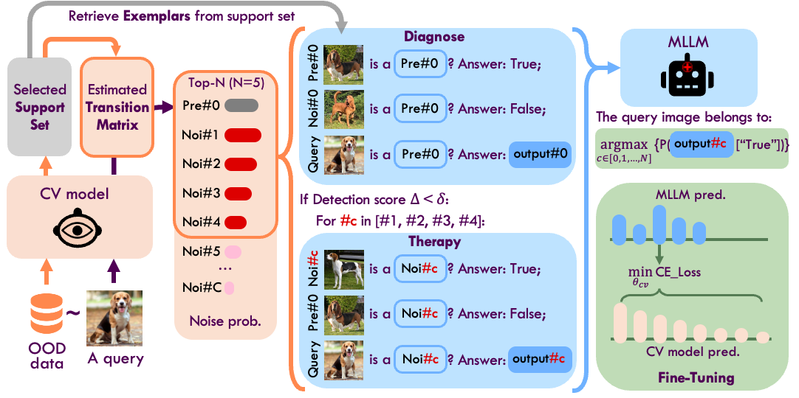

# [Machine Vision Therapy: Multimodal Large Language Models Can Enhance Visual Robustness via Denoising In-Context Learning](https://arxiv.org/abs/2312.02546)

Zhuo Huang<sup>1</sup>, Chang Liu<sup>2</sup>, Yinpeng Dong<sup>3</sup>, Hang Su<sup>3, 4</sup>, Shibao Zheng<sup>2</sup>, Tongliang Liu<sup>1</sup>

<sup>1</sup>The University of Sydney, <sup>2</sup>Shanghai JiaoTong University, <sup>3</sup>Tsinghua University, <sup>4</sup>Peng Cheng Laboratory


Although vision models such as Contrastive Language-Image Pre-Training (CLIP) show impressive generalization performance, their zero-shot robustness is still limited under Out-of-Distribution (OOD) scenarios without fine-tuning. Instead of undesirably providing human supervision as commonly done, it is possible to take advantage of Multi-modal Large Language Models (MLLMs) that hold powerful visual understanding abilities. However, MLLMs are shown to struggle with vision problems due to the incompatibility of tasks, thus hindering their utilization. In this paper, we propose to effectively leverage MLLMs to conduct Machine Vision Therapy which aims to rectify the noisy predictions from vision models. By fine-tuning with the denoised labels, the learning model performance can be boosted in an unsupervised manner. To solve the incompatibility issue, we propose a novel Denoising In-Context Learning (DICL) strategy to align vision tasks with MLLMs. Concretely, by estimating a transition matrix that captures the probability of one class being confused with another, an instruction containing a correct exemplar and an erroneous one from the most probable noisy class can be constructed. Such an instruction can help any MLLMs with ICL ability to detect and rectify incorrect predictions of vision models. Through extensive experiments on ImageNet, WILDS, DomainBed, and other OOD datasets, we carefully validate the quantitative and qualitative effectiveness of our method.


# Overview


## MLLMs
 **MMICL**: [MMICL-FLANT5XXL](https://huggingface.co/BleachNick/MMICL-Instructblip-T5-xxl);  [MMICL-Tiny](https://huggingface.co/BleachNick/MMICL-Instructblip-T5-xl)

 **Otter**: [OTTER-Image-LLaMA7B-LA-InContext](https://huggingface.co/luodian/OTTER-Image-LLaMA7B-LA-InContext)
 - Please download the Otter repo to a different directory from MVT through:
```
git clone https://github.com/Luodian/Otter.git
```
 To avoid top-level reference, please change the `line 19` - `line 21` in `Otter/src/otter_ai/models/otter/modeling_otter.py` as:
```
from falcon.modelling_RW import RWForCausalLM
from mpt.modeling_mpt import MPTForCausalLM
from mpt_redpajama.mosaic_gpt import MosaicGPT
```
 
## Vision Models
 **CLIP**: RN50, RN101, RN50x4, RN50x16, RN50x64, ViT-B/32, ViT-B/16, ViT-L/14, ViT-L/14@336px, ViT-g, ViT-G, etc. Please see [CLIP from openai](https://huggingface.co/openai) and [CLIP from openclip](https://huggingface.co/models?library=open_clip).

## Capabilities
 Machine Vision Therapy can enhance the visual robustness on various circumstances, for example:
+ <mark>**Generalization on both ID and OOD data**<mark>

+ <mark>**Robustness against Domain Shift**<mark>

+ <mark>**Robustness against Common Corruptions**<mark>

+ <mark>**Recognizing Fine-Grained Attributes**<mark>

+ <mark>**Robustness against Spurious Correlations**<mark>

+ <mark>**Detecting Prediction Errors and OOD Data**<mark>


## Setup
We conduct our experiment with Anaconda3. If you have installed Anaconda3, then create your own environment and install python packages as follows:

```
pip install -r requirements.txt
```


## Datasets
We use various ID and OOD datasets, including ImageNet, ImageNet-A, ImageNet-R, ImageNet-Sketch, ImageNet-V2, ImageNet-V, ImageNet-C, PACS, VLCS, OfficeHome, DomainNet, iWildCam, CelebA, Spawrious, CIFAR10/100, and MNIST.

To specify a dataset:
```
--dataset: specify a dataset from ['mnist', 'cifar10', 'iwildcam', 'celebA', 'imagenet', 'cifar100', 'domainbed']
```

Further, for ImageNet-based datasets and DomainBed-based datasets, please set:
```
--chosen_name: specify a ImageNet-based dataset from ['ImageNet', 'ImageNetV2', 'ImageNetA', 'ImageNetR', 'ImageNetSketch', 'ImageNetV', 'ImageNetC', 'domainbed'] or a DomainBed-based dataset from ['PACS', 'VLCS', 'OfficeHome', 'DomainNet']
```

Moreover, there are several domains in each dataset from DomainBed, so in this case, you need to set the target domain by:
```
--target: choose one target domain.
```


### ImageNet-based dataset

To download ImageNet-based datasets, please follow the instructions below:

```bash
export DATA_LOCATION=~/data
cd $DATA_LOCATION
```

#### [ImageNet](http://www.image-net.org/)
- Please download the ImageNet dataset from the [official website](http://www.image-net.org/)


#### [ImageNet-A](https://github.com/hendrycks/natural-adv-examples)

```bash
wget https://people.eecs.berkeley.edu/~hendrycks/imagenet-a.tar
tar -xvzf imagenet-a.tar
rm imagenet-a.tar
```

#### [ImageNet-R](https://github.com/hendrycks/imagenet-r)

```bash
wget https://people.eecs.berkeley.edu/~hendrycks/imagenet-r.tar
tar -xvzf imagenet-r.tar
rm imagenet-r.tar
```

#### [ImageNet-Sketch](https://github.com/HaohanWang/ImageNet-Sketch)

Download links:
- from [Google Drive](https://drive.google.com/open?id=1Mj0i5HBthqH1p_yeXzsg22gZduvgoNeA)
- from [Kaggle](https://www.kaggle.com/wanghaohan/imagenetsketch)

#### [ImageNet-V2](https://github.com/modestyachts/ImageNetV2)

```bash
wget https://s3-us-west-2.amazonaws.com/imagenetv2public/imagenetv2-matched-frequency.tar.gz
tar -xvf imagenetv2-matched-frequency.tar.gz
rm imagenetv2-matched-frequency.tar.gz
```

#### [ImageNet-V](https://github.com/Heathcliff-saku/ViewFool_)

Download links:
- from [Google Drive](https://drive.google.com/file/d/1oxrWl4mRa_mEr-ByCMhyRWaQG8Wribo7/view)


#### [ImageNet-C](https://github.com/hendrycks/robustness)

- For producing corruptions, please follow the codes in https://github.com/hendrycks/robustness/blob/master/ImageNet-C/create_c/


### [DomainBed](https://github.com/facebookresearch/DomainBed/tree/main)

- For downloading of PACS, VLCS, OfficeHome, DomainNet, and other datasets with domain shift, please follow the code in https://github.com/facebookresearch/DomainBed/blob/main/domainbed/scripts/download.py


### iWildCam from [WILDS](https://github.com/p-lambda/wilds)

- Please follow the download instructions from WILDS:
```
pip install wilds
python wilds/download_datasets.py --root_dir data --dataset iwildcam
```

- Before using the wilds package, please replace the `wilds/datasets/wilds_dataset.py` with the modified file in `.mydataset/wilds_dataset.py`

* Note that we only choose iWildCam is because that the images of wild animals can be described in texts, but other datasets such as remote sensing and medical imaging cannot be effectively expressed as commonly-known concepts.


### [CelebA](https://mmlab.ie.cuhk.edu.hk/projects/CelebA.html)

- Please download the CelebA dataset at https://worksheets.codalab.org/rest/bundles/0xfe55077f5cd541f985ebf9ec50473293/contents/blob/
- The grouping process for selecting attributes is conducted in `wilds/datasets/celebA_dataset.py`. However, please make sure replacing the codes from `line 60` - `line 65` in `celebA_dataset.py` as follows:

```
    def __init__(self, version=None, root_dir='data', download=False, split_scheme='official', target_name='Male'):
        self._version = version
        self._data_dir = self.initialize_data_dir(root_dir, download)
        confounder_names = ['Male', 'Wearing_Hat', 'Smiling', 'Eyeglasses', 'Blond_Hair', 'Mustache', 
                            'Attractive', 'Wearing_Lipstick', 'Wearing_Necklace', 'Wearing_Necktie', 'Young', 'Bald']
        confounder_names.remove(target_name)
```


### [Spawrious dataset](https://github.com/aengusl/spawrious)

- Please download the dataset at [Spawrious](https://www.dropbox.com/s/e40j553480h3f3s/spawrious224.tar.gz?dl=1)
- For generating different types and different levels of spurious correlation, please follow the code in `.DomainBed_datasets/domainbed/datasets.py`


## Running Experiments

As described in our paper, there are three stages: Transition Matrix Estimation, Denoising In-Context Learning, and Fine-Tuning.

### Transition Matrix Estimation

First, please run `modeling_transition_matrix.py` to generate a tranistion matrix tensor which is stored in `.tran_mat/`

```
CUDA_VISIBLE_DEVICES=0,1,2,3 python modeling_transition_matrix.py --dataset [specify general dataset] --chosen_name [specify detailed dataset] --vit_type [vision model type]  --targets [choosen target domain] --labeling_budget [number of labels for each class in the support set]
```

For example:
```
CUDA_VISIBLE_DEVICES=0,1,2,3 python modeling_transition_matrix.py --dataset imagenet --chosen_name ImageNetA --vit_type vit-l --labeling_budget 10
```

### Denoising In-Context Learning

Then, please conduct DICL by running `dicl.py`:

```
CUDA_VISIBLE_DEVICES=0,1,2,3 python dicl.py --dataset [specify general dataset] --chosen_name [specify detailed dataset] --vit_type [vision model type]  --targets [choosen target domain] --num_retrieve [number of retrieved exemplars from the support set] --num_exemplar [number of exemplars in the support set] --stop_iteration [number of iterations for conducting DICL]
```

For example:
```
CUDA_VISIBLE_DEVICES=0,1,2,3 python dicl.py --dataset imagenet --chosen_name ImageNetA --vit_type vit-l --num_retrieve 3 --num_examplar 3 --stop_iteration 5000
```

After DICL, the therapy results will be stored in a `.json` file in `.logits/`. The format is:
```
{
mvt_acc: accuracies of MVT
clip_acc: accuracies of vision model,
logits: stored logits for further Fine-Tuning
}
```

where the logits is formed as:
```
{image_path: [top_N_predictions, top_N_logits]}
```

The prediction class index with largest logit value will be used a learning target for Fine-Tuning.


### Fine-Tuning

Please run `fine_tuning.py` as follows:

```
CUDA_VISIBLE_DEVICES=0 python fine_tuning.py --dataset [specify general dataset] --chosen_name [specify detailed dataset] --vit_type [vision model type]  --targets [choosen target domain] 
```

For example:
```
CUDA_VISIBLE_DEVICES=0 python fine_tuning.py --dataset imagenet --chosen_name ImageNetA --vit_type vit-l
```

In `fine_tuning.py`, the data paths `meta_file` of all test data is stored in `.txt` files, and the therapy results `teacher_json` only contains a subset of test data that need to be enhanced.


## Reference
<br> **📑 If you find our paper and code helpful for your research, please consider citing:** <br>
```
@article{huang2023machine,
  title={Machine Vision Therapy: Multimodal Large Language Models Can Enhance Visual Robustness via Denoising In-Context Learning},
  author={Huang, Zhuo and Liu, Chang and Dong, Yinpeng and Su, Hang and Zheng, Shibao and Liu, Tongliang},
  journal={arXiv preprint arXiv:2312.02546},
  year={2023}
}
```

If you have any problems, please feel free to raise an issue or directly contact [zhuohuang.ai@gmail.com](zhuohuang.ai@gmail.com).
